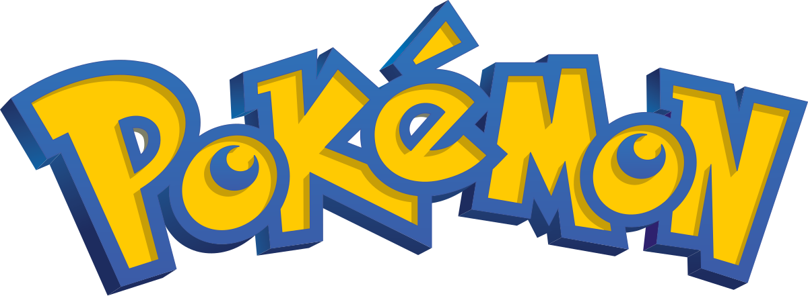

# ***Programmers*** 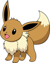
- [Lucas Lemes](https://github.com/L3mSv) 
- [Décio Luvier](https://github.com/DecioLuvier) 

 # ***Introduction*** 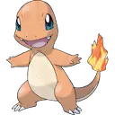

Pokémon is a franchise from The Pokémon Company, created in 1995 by 
Satoshi Tajiri. The game centers on fictional creatures called “Pokémon”. These 
creatures can be captured and trained by humans to fight against each other 
like a sport.
    

  
    

      The work consists of implementing the Pokémon game using the <strong>Java language</strong>.
    

    

    The game that must be implemented is a variant of the original game, as it has specific characteristics 
    and different. The Pokémon will be dispersed in a rectangular area divided into cells, similar to a table.  A cell may or may not contain a Pokémon. This area will also have a subdivision for 
    represent the specific regions of existing Pokémon types. In each play, the player must choose 
    a cell in search of Pokémon. If a wild Pokémon is found, the Poké Ball will be used to attempt 
    capture it. If the Pokémon found is from another Trainer, a battle will be held between them. In this 
    version of the game, the winning Pokémon also gains experience points. These points will be updated every 
    play to indicate the winning player so far. The game ends when all available Pokémon 
    have been captured. In the first case, the winning player will be the one who has the Pokémon team with the most 
    experience score.

# ***Class Diagram*** 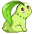
This is the resulting class diagram of the program, designed using the PlantUML tool

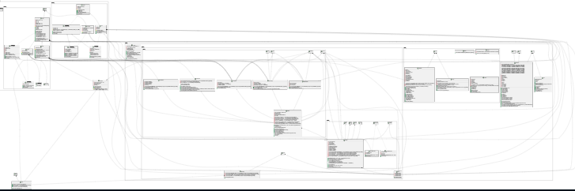

>[!NOTE]
>If you are interested in viewing this diagram on your machine, you will need to 
>download the tool from the [PlantUML](plantuml.com) website or if you are using 
>Vscode IDE, it provides 
>a plantUML extension that already does the job, but I still recommend taking a look
>at the website to see what the code syntax is like at least.

# ***Concepts Used*** 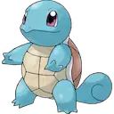

✅ - **Composition**   
Used in the Type, Tile, Manager, Move classes, and among other classes, taking as an example in the Actor class, composition is used in relation to the Sprite class to show the game's drawings. 

✅ - **Inheritance**  
Used in practically all classes such as Actor, Listener, Button, in the case of Button it is inherited from Actor because every button is an actor within the program logic 

✅ - **Pattern Design**  
The design patterns used mostly were Builder and Singleton for classes such as Actors, Buttons, Sprites, Text, as they are components that are part of a larger and more complex whole, which facilitates the creation and management of these parts, being divided into sectors as the pattern proposes. In the case of the Singleton pattern, it was used in the Manager because it is more logical to have only one Manager instead of being able to instantiate several. 

✅ - **Polimorfism**   
Methods like OnClick and OnTick have been overridden several times in the program structure to adapt in the most efficient and useful way to each class. 

✅ - **ArrayList**  
Used to store Pokémon in the Pokedex and to store the player's team. 

✅ - **Encapsulation**  
Used throughout the program to configure the access level of both variables and methods in classes and interfaces, with protected, public, private and sometimes default. 

✅ - **Interface**  
Two interfaces were created in the program Command.java and Drawable.java 

✅ - **Exception**  
Used to control and warn of errors throughout the program, but more intensively in classes that involve writing and reading files such as Sprite.java, Animation.java and Text.java 

✅ - **Abstract Class**   
Because we used Interface, we also used abstract classes. 

✅ - **Concurrent programming**  
Used to configure the computer's play algorithm through Threads 

✅ - **Serialization**  
Used in Command.java and Data.java via the Serializable library 

# ***Run the Program*** 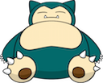

<marquee behavior="scroll" direction="right" scrollamount="10">
  
</marquee>

Run the program through an IDE with JAVA extension or compile the .java files and create a bytecode file run on it.

# ***Examples of use*** 

## **Initial Screen** 

<table>
  <tr>
    <td width="60%">
    

  The home screen features a retro Game Boy-inspired layout, with blue borders and digital buttons reminiscent of the classic handheld console. In the center, the Pokémon UFPEL Version logo is prominently displayed, accompanied by a mysterious purple Pokémon silhouette, conveying an air of mystery and challenge.

  At the bottom of the screen, the main menu offers four options:

  - <b>New Game</b>: Starts a new journey.

  - <b>Continue Game</b>: Resumes saved progress.

  - <b>Custom Level</b>: Allows you to play custom levels (disabled by default).

  - <b>Level Builder</b>: Level creation mode (also disabled initially).

  The design evokes the aesthetics of the franchise's classic games, conveying nostalgia and authenticity to players right from the start.
  

    </td>
    <td width="40%">
      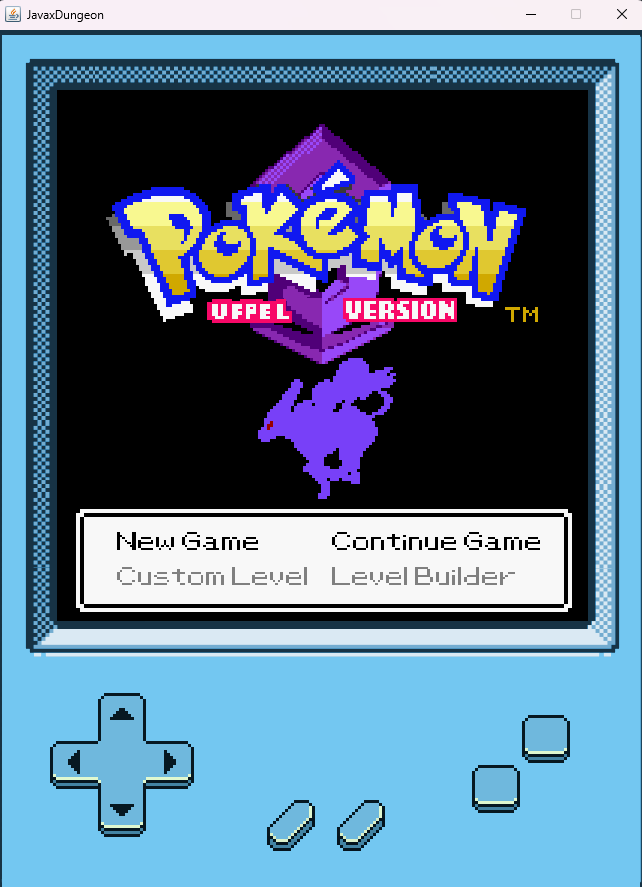
    </td>
  </tr>
</table>

## **Grid Screen** 

<table>
  <tr>
    <td width="40%">
      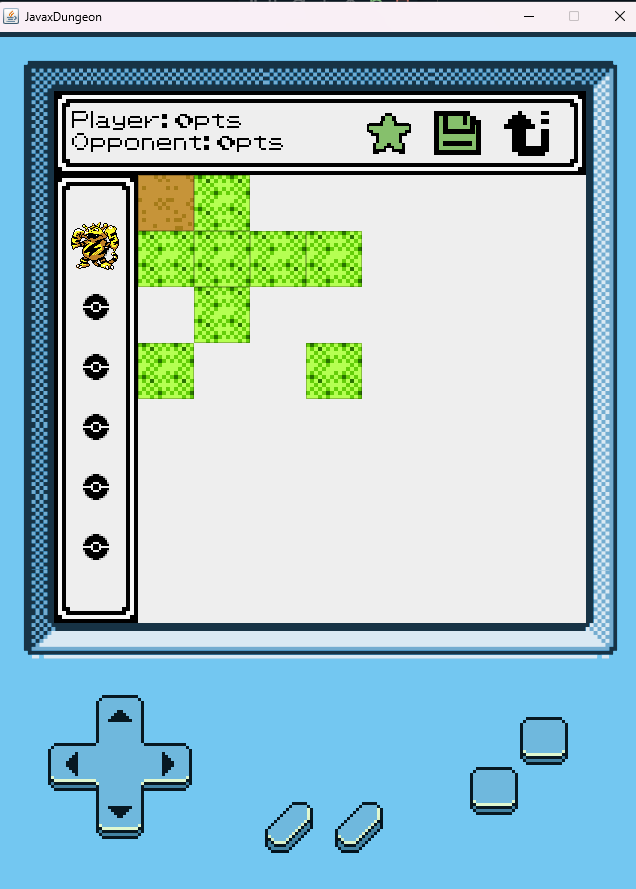
    </td>
    <td width="60%">
      

        This is the game board screen. The board itself is represented by blocks where there may or may not be a hidden Pokémon. This will be the dynamic of the game where the player will be competing against the computer to find all the Pokémon hidden on the board and, at the end, comparing the number of Pokémon caught between the player and the computer to decide the winner.
          
        There are also two other information sections, located at the top is the player statistics screen and on the side is the user's pokedex.
      

    </td>
  </tr>
</table>

## **Player Status**

<table>
  <tr>
    <td width="60%">
    

  This is the player status window in it shows the amount of pokemons captured by both the player and the computer, in addition to this data there are also three specific icons 
    
  💾 : Save the game  
  ⭐️ : Receive a tip  
  ↩️ : Back to main menu  
  

    </td>
    <td width="40%">
      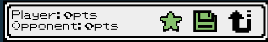
    </td>
  </tr>
</table>

## **Pokedex** 

<table>
  <tr>
    <td width="40%">
      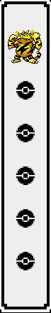
    </td>
    <td width="60%">
    

    This is the player's pokedex tab in it appear the player's pokemons having a maximum amount of 6 pokemons and can change their order in your team being the pokemon that is more to the top of pokedex your main pokemon and that will start in battle 
    

    </td>
  </tr>
</table>

# **Battle** 

<table>
  <tr>
    <td width="60%">
    

  When you find a pokemon on the board you will be directed to battle, it is practically the same as a classic pokemon game having the options of FIGHT, PKM, BALL and RUN, the only difference compared to the battles of the classic games and that the fight does not occur in turns but sequentially live making the player choose his options during the battle 

  <b>FIGHT</b> : Choose the pokemon skill  

  <b>PKM</b>: Pokemon exchange  

  <b>BALL</b>: Play pokeball to capture wild pokemon  

  <b>RUN</b> : Out of battle  
    

    </td>
    <td width="40%">
      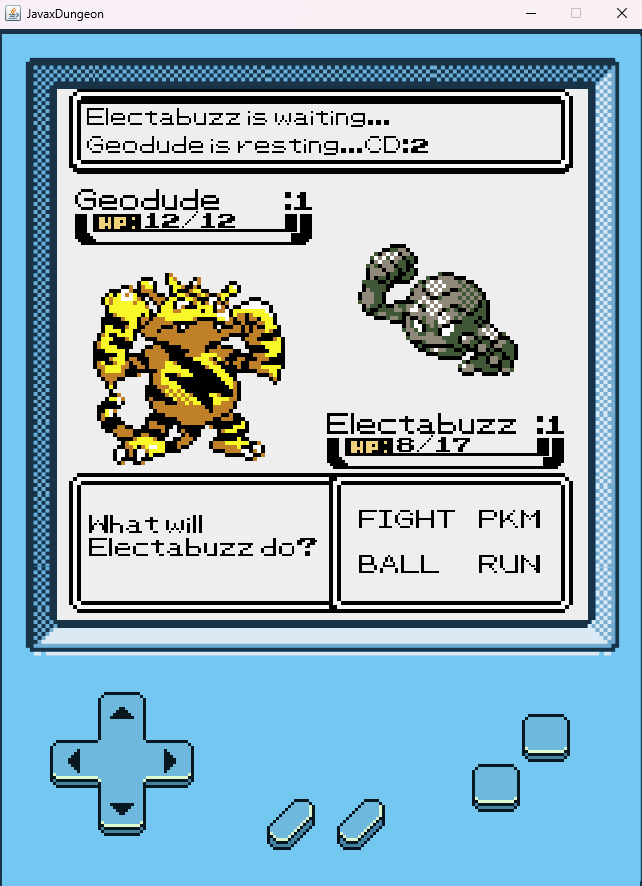
    </td>
  </tr>
</table>

# ***Difficulties*** 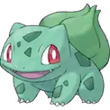

## **Game Logic**
- **Rooms:** switch between screens (map, battle, inventory, menu, etc.) without bugs.
- **Battle:** create the Pokémon battle model, including damage calculation, status effects, move priority, types, and resistances.

## **Data and Structure**
- **Pokédex:** store hundreds of Pokémon, their attributes, types, moves and evolutions.
- **Balancing:** Adjusting statistics so that the game is playable and fair.
- **Persistence:** saving and loading progress (captured Pokémon).

## **Game World**
- **Grid:** draw the map of the game board.

## **Technical Aspects**
- **Performance:** Prevent the game from crashing with too many sprites on screen.
- **Code organization:** implement Builder and Singleton design patterns.
- **Testing:** Ensure there are no bugs (softlocks, frozen battles, logic flaws).

# ***Conclusion*** 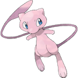

Finally this work provides a program in pokemon theme for the community to have fun and analyze the structured code, using concepts learned in OOP classes efficiently in order to optimize the program and especially work with the main concept of the JAVA language "code reuse".

_For those of you playing, feel free to explore the game's features and the code itself!_
  

***GOODBYE!***

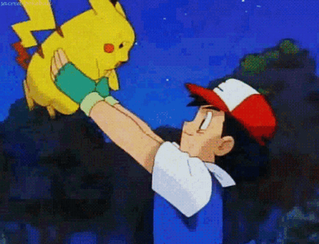